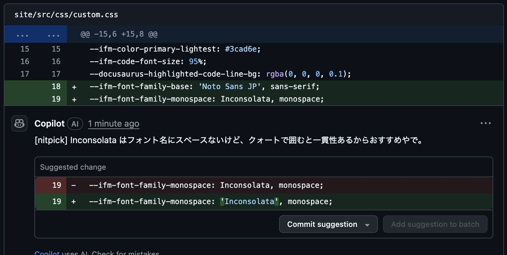

小ネタですが、GitHub CopilotにPull Requestのレビューを依頼するとき、どのようにレビューして欲しいかを指示できます。

とはいえ、明確な「GitHub Copilotレビューの設定」というものはないです。

でも、GitHub CopilotはPull Requestの本文を読み取ってレビューするので、そこに指示を入れ込めます。
ただ、無視されることも割とあります。

## GitHub Copilotにレビュー方針を指示する

Pull Requestの本文の先頭に、HTMLコメントで指示を入れます。

```md
<!-- このPull Requestは関西弁でレビューしてください。 -->
```

このように書いておくと、関西弁でレビューしてくれたり、してくれなかったりします。
以下は成功した例です。



## 無難な使い方

「日本語でレビューしてください」が無難です。

```md
<!-- このPull Requestは日本語でレビューしてください。 -->
```

これだけで、デフォルトの英語ではなく日本語でレビューしてくれるので、かなり分かりやすくなります。

## 関西弁以外は使える？

有名な方言とかぐらいだったら使えるかもしれません。（試してない）

試したのは以下です。ただ、どれもうまくいきませんでした。。（英語でレビューされた）

- 「ツンデレでレビューして」
- 「お嬢様口調でレビューして」

なんか色々と遊んでみて、うまくいった事例があったら教えてくれると嬉しいです。

（コメント機能はないので [GitHub Issue](https://github.com/daiksud/daiksud/issues/39) にください (^^;)）

生成AIは面白いですね。

いつか音声認識と音声合成を搭載して、画面もシェアしながら、可愛い声のAIとペアプログラミングしたい。
